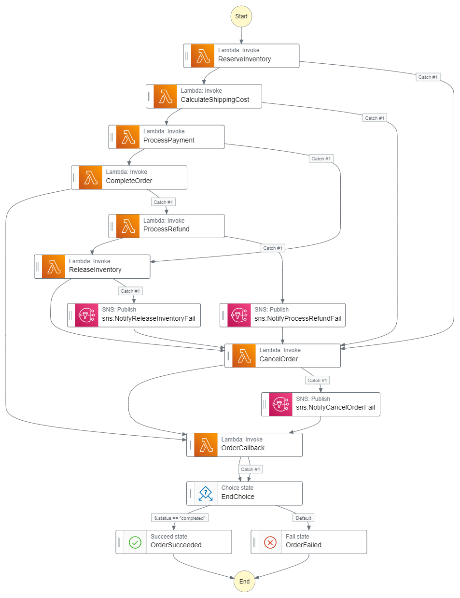

# CHALLENGE - CALCULATE SHIPPING COST

[](https://github.com/romarcablao)
[](https://linkedin.com/in/romarcablao)

## A. Requirements

1. Create a new Lambda function to calculate the shipping cost. Formula for the delivery cost is as follows:
   > Shipping Cost = "Last digit of postcode"/2 + 2
2. Add the Lambda function as a new step in the Step Function definition. The Lambda function must be executed prior to the ProcessPayment step in the Step Function definition file.
3. Return/Append the ShippingCost attribute in the output JSON of the Lambda function.
4. Modify ProcessPayment Lambda function to add the shipping cost to the total payment amount.

## B. My Solution

1. CalculateShippingCostFunction  
   You may use the code below to get the last digit of the postal code and use the formula defined in the requirements above.

   ```js
   function getNthDigit(val, n) {
     var modVal = val % Math.pow(10, n);
     return Math.floor(modVal / Math.pow(10, n - 1));
   }

   exports.handler = async (event) => {
     const { postCode } = event.shippingAddress;
     event.paymentDetail.shippingCost = getNthDigit(postCode, 1) / 2 + 2;
     return event;
   };
   ```

2. ProcessPaymentFunction

   ```js
   // add shipping cost
   paymentAmount += order.paymentDetail.shippingCost || 0;
   ```

3. Step Function ASL  
   Add inside `States`, after `ReserveInventory`

   ```json
       "CalculateShippingCost": {
       "Comment": "Task to reserve order items in inventory",
       "Type": "Task",
       "Resource": "${CalculateShippingCostFunctionArn}",
       "TimeoutSeconds": 10,
       "Catch": [
           {
           "ErrorEquals": ["ErrCalculateShippingCost"],
           "ResultPath": "$.error",
           "Next": "CancelOrder"
           }
       ],
       "Next": "ProcessPayment"
       },
   ```

4. SAM Template

   a. Add `CalculateShippingCostFunction`

   ```yaml
   # add
   CalculateShippingCostFunction:
   Type: "AWS::Serverless::Function"
   Properties:
     Description: "Calculate shipping cost"
     FunctionName: "CalculateShippingCostFunction"
     Handler: "index.handler"
     CodeUri: src/order/CalculateShippingCostFunction/
     MemorySize: 128
     Runtime: "nodejs12.x"
     Timeout: 3
   ```

   b. Update the existing `StepFunctionsStateMachine` by adding `CalculateShippingCost` details

   ```yaml
   # update
   StepFunctionsStateMachine:
   Type: "AWS::Serverless::StateMachine"
   Properties:
     Name: "OrderOrchestrator"
     DefinitionUri: statemachine/order-orchestrator.asl.json
     DefinitionSubstitutions:
     ReserveInventoryFunctionArn: !GetAtt ReserveInventoryFunction.Arn
     CalculateShippingCostFunctionArn: !GetAtt CalculateShippingCostFunction.Arn
     ReleaseInventoryFunctionArn: !GetAtt ReleaseInventoryFunction.Arn
     ProcessPaymentFunctionArn: !GetAtt ProcessPaymentFunction.Arn
     ProcessRefundFunctionArn: !GetAtt ProcessRefundFunction.Arn
     CompleteOrderFunctionArn: !GetAtt CompleteOrderFunction.Arn
     CancelOrderFunctionArn: !GetAtt CancelOrderFunction.Arn
     OrderWSCallbackFunctionArn: !GetAtt OrderWSCallbackFunction.Arn
     OrderSagaFailTopicArn: "arn:aws:sns:${AWS::Region}:${AWS::AccountId}:${OrderSagaFailTopic.TopicName}"
     Type: "STANDARD"
     Policies:
       - LambdaInvokePolicy:
           FunctionName: !Ref ReserveInventoryFunction
       - LambdaInvokePolicy:
           FunctionName: !Ref CalculateShippingCostFunction
       - LambdaInvokePolicy:
           FunctionName: !Ref ReleaseInventoryFunction
       - LambdaInvokePolicy:
           FunctionName: !Ref ProcessPaymentFunction
       - LambdaInvokePolicy:
           FunctionName: !Ref ProcessRefundFunction
       - LambdaInvokePolicy:
           FunctionName: !Ref CompleteOrderFunction
       - LambdaInvokePolicy:
           FunctionName: !Ref CancelOrderFunction
       - LambdaInvokePolicy:
           FunctionName: !Ref OrderWSCallbackFunction
       - SNSPublishMessagePolicy:
           TopicName: !GetAtt OrderSagaFailTopic.TopicName
   ```

## C. Output



## D. Reference

1. [DevAx Lab](https://workshops.devax.academy/monoliths-to-microservices/module8/challenge_calculate_shipping.html)
